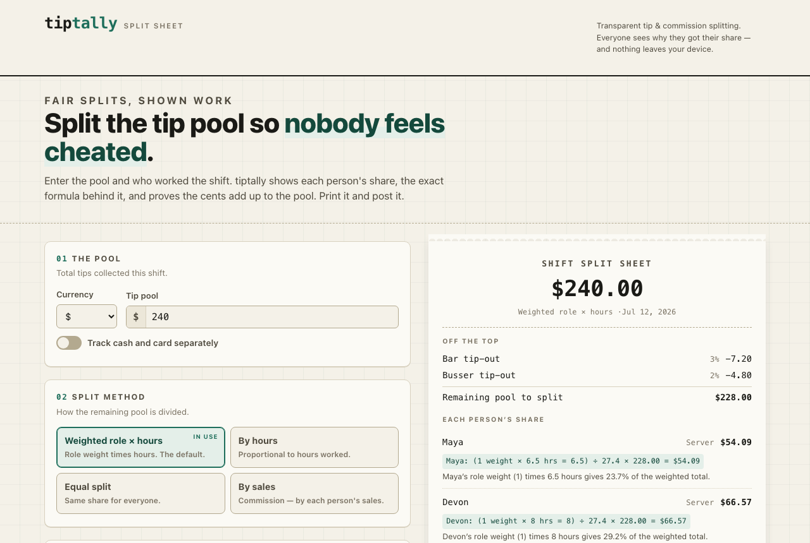

# tiptally

A fair tip-split and tip-out calculator that shows its work — so a shift's tips can be divided in a way the whole team can see is even-handed.



## Why it exists

"Split the tips" sounds simple until you try to do it fairly. Roles contribute differently, hours differ, the bar and bussers get a tip-out off the top, and percentage shares almost never land on whole cents — so someone always ends up feeling short-changed. tiptally does the arithmetic four ways (weighted role-hours, by hours, equal, or by sales), takes tip-outs off the top first, and prints a split sheet that spells out the exact formula behind every share and proves the cents add up to the pool. It runs entirely in the browser: no accounts, no tracking, and a strict content-security policy that blocks any outbound connection, so nothing about a shift ever leaves the device.

## Quickstart

```sh
npm install      # install dependencies
npm run dev      # local dev server at http://localhost:4321
npm run build    # production build to ./dist
```

Everything is static — the built `dist/` folder can be hosted on any static host.

## Disclaimer

tiptally is a math tool for making a split transparent; it is **not legal, payroll, or tax advice**. Tip-pooling and tip-credit rules vary by country, state, and role. The software is provided "as is" under the MIT License, without warranty of any kind, and the authors accept no liability for how any split is used. Verify any arrangement against your local labor law and your workplace policy before using it to pay people.

## License

[MIT](./LICENSE) © 2026 Sreenivas Sadhu Prabhakara
